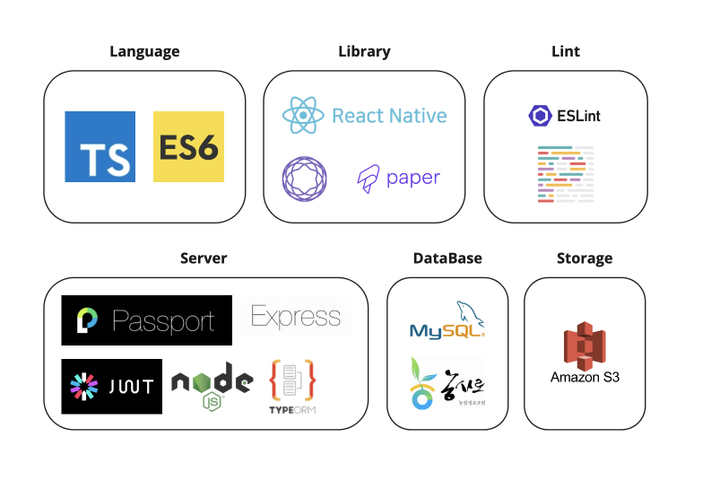
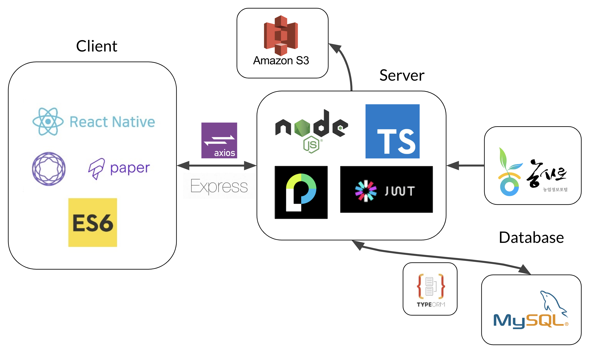
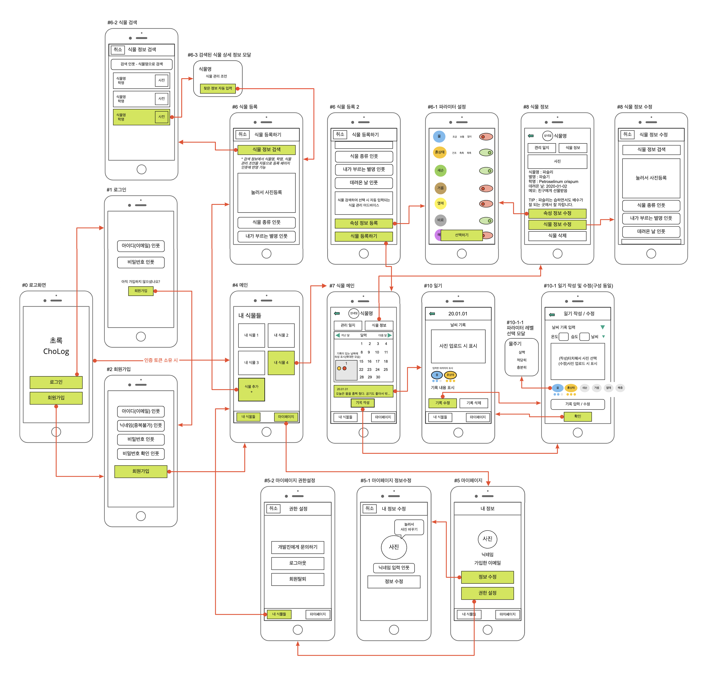
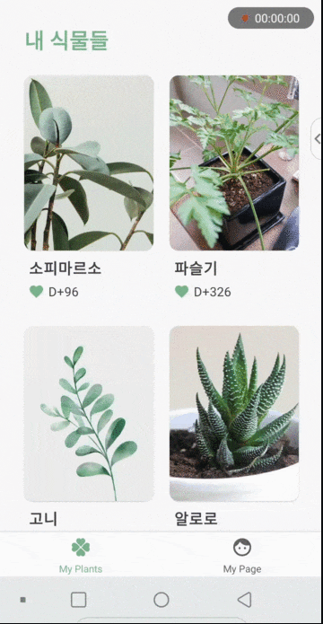

# 프로젝트 ChoLog

## 1. Intro

---

- **팀 명 :** 009900
- **프로젝트 명 :** ChoLog - 초록
- **팀원 :** 윤슬기(팀장), 태라미, 민태관, 김희주
- **배포 링크 :** 배포 후 추가하겠습니다.

## 2. Project

---

## 식물 관리 어플리케이션 ChoLog - 초록草録

### 프로젝트 소개

화초세대, 반려식물이라는 단어를 들어보셨나요?

집에서 식물을 키우는 사람들이 많아지면서 등장한 단어입니다.

위 단어에서 알 수 있듯이 최근 집에서 식물을 키우는 사람들이 부쩍 늘었습니다.

자라나는 식물들의 성장을 간편하게 기록하고 관리하는 서비스 ‘**초록**'은

식물 이미지를 대표하는 색인 초록색,

그리고 풀 초(草)자 와 기록할 록(錄) 자를 사용해 '풀을 기록하다' 는 두 가지 뜻을 지니고 있습니다.

영어로 표기할 땐 기록을 뜻하는 ‘Log’를 넣어 기록한다라는 의미를 나타냈습니다.

### 주요 기능

- 식물 정보 등록 및 관리 기능
- 식물 관리 상태 기록 기능
- 직관적으로 선택할 수 있는 파라미터(식물 관리 항목) 입력 기능
- 한 눈에 관리 기록 현황을 보여주는 달력 기능
- 상세 정보와 관리 팁을 제공하는 식물 정보 검색 기능

### 사용 스택

### 스택 아키텍쳐

### 기능 Flow

### **시연 GIF**

| 시연 GIF                                                                |                                                                                     |                                                          |
| ----------------------------------------------------------------------- | ----------------------------------------------------------------------------------- | -------------------------------------------------------- |
| 회원가입                              | 로그인                                          | 로그아웃               |
| 식물 상세정보 적용 및 등록  | 속성 선택(관리 시 기록할 항목)  | 식물 검색    |
| 식물 기록 작성                | 식물 기록 수정                            | 월별 달력보기  |
| 식물 정보 수정        | 유저 정보 수정                              |                                                          |

### 기타 링크

- 서버 API 문서 | [https://app.gitbook.com/@team-009900-official/s/cholog/](https://app.gitbook.com/@team-009900-official/s/cholog/)

## 3. Members

---

### 팀장 : 윤슬기

---

- Role : Team Leader
- Position : Front-end
- Stack : React Native / React Navigation 5.x / React Hooks / React Native Paper
- Works : 클라이언트 전반 구현
  1. UX/UI 설계
  2. 디자인을 바탕으로 Component와 Navigation 설계
  3. UI 라이브러리와 CSS를 이용한 디자인 구현
  4. Component 구현과 관련 API 연결
     1. 마이 페이지 - 사용자 정보 표시, 수정, 로그아웃 및 탈퇴
     2. 식물 정보 - 식물 정보 등록, 표시, 수정 및 삭제
     3. 식물 기록 - 관리 기록 등록, 표시, 수정 및 삭제
     4. 속성 정보 - 식물 별 관리 속성 설정, 관리 기록에 표시 및 수정
     5. 식물 검색 - 검색 결과 표시 및 식물 정보에 자동 반영
- Blog: https://velog.io/@sgyoon

### 팀원 : 태라미

---

- Role : Team Member
- Position : Back-end
- Stack : Node.js / Express / TypeScript / TypeORM / MySQL / AWS S3
- Works : 서버 전반 구현
  1. Server design
  2. DB design
     - DB 스키마 설계 및 API gitbook 문서 작성
     - TypeORM 으로 초기 테이블의 migration, entity, entity사이의 relation 생성
  3. 공공API에서 식물 데이터 검색에 필요한 데이터 받아와서 DB 구성(식물 이름, 학명, 식물의 이미지들)
  4. AWS S3에 이미지 업로드, 삭제 기능 구현
  5. API 구현
     - user: 유저 정보 보내주기, 정보 수정, 회원탈퇴, 유저의 식물들정보 응답해줌.
     - diary: 일기 쓰기(+array로 받은 식물 상태 기록), 일기 수정(식물 상태 수정), 일기 삭제, 일기응답요청 처리
     - plantsDB:
       - 검색용 데이터베이스에서 식물 검색. 최초 1회 접근 시 외부API에 식물의 상세 정보 요청 후 가공해서 데이터베이스에 저장.
       - 식물 상세 정보 보내주기: 식물정보를 조합하여 상세 데이터 보내주기
- Blog: [https://ram-t.tistory.com/](https://ram-t.tistory.com/)

### 팀원 : 민태관

---

- Role : Team Member
- Position : Front-end
- Stack : React Native / React Navigation 5.x / React Hooks / React Native Paper
- Works : 클라이언트 전반 구현
  1. Authentication flows
  2. UX/UI를 고려한 기능 구현
  3. 클라이언트-서버 연결
  4. Component 설계 및 구현
     - 로그인, 회원가입, 로그아웃

* 식물 정보 - 달력, 일지 목록 \* 식물 목록, 식물 검색

- Blog: https://velog.io/@tkmin

### 팀원 : 김희주

---

- Role : Team Member
- Position : Back-end
- Stack : Node.js / express / TypeScript / Passport / TypeORM / MySQL / JWT
- Works : 서버 전반 구현
  1. Server design
  2. Passport + JWT auth
  3. 어플 디자인 + 일러스트 제작
  4. API 작성
     - plant: 식물 생성, 식물 삭제, 식물 정보 수정, 월별 식물 다이어리 보기, 나의 식물 보기
     - parameter: 파라미터 기본 seed 생성, 파라미터 선택, 모든 파라미터 보기
     - weather: 기본 weather seed 생성, 날씨 가져오기
  5. DB
     - DB 스키마 설계 및 API gitbook 문서 작성
- Blog: https://velog.io/@heejuice
